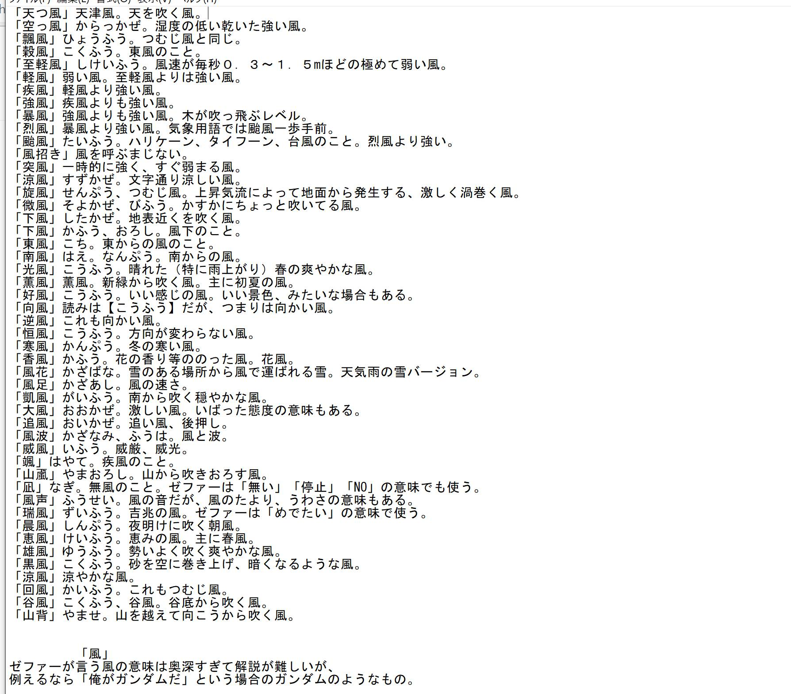
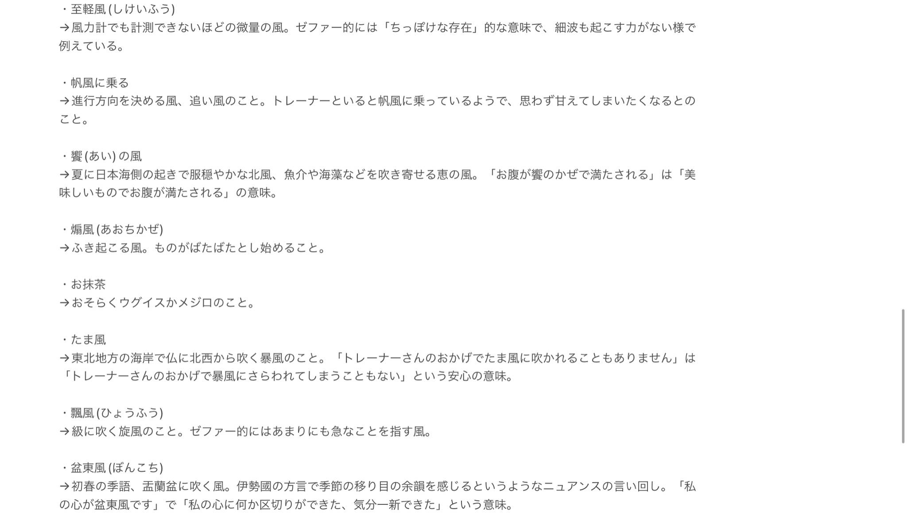

Listing useful and recurring terms or niche information to aid translations and form the basis of the project's translation standards.

# General

## Dialogue
Term | Translation
---|---
ウマ娘 | Horsegirl
選抜レース | Selection Race
種目別競技大会 | Semiannual Race Meet (shortened: (the) Meet, because it's the only one and a large event)

## Game
Term | Translation
---|---
覚醒Lv強化 (覚醒, Lvアップ (?)) | awakening (leveling up umas)
Lv強化 (強化) | strengthening/upgrade (leveling up cards)
才能開花 (開花) | developing/blooming (uma uncap)
上限解放 (解放) | uncapping (cards)

## Skills
Not fully set yet.

Term | Translation
---|---
ものすごく | greatly
すごく | a lot
少し | lightly, somewhat
わずかに | slightly
ちょっと | a little
ほんのわずかに | very slightly
ほんのちょっと | a tiny bit?

# Horsegirls

## Daitaku Helios

## Neo Universe
Term | Explanation
---|---
AMRT, AMaRTi | love/ I love you
INTI | intimate 
THNK | thanks / think?
REQU | Requirements 
WORR | worry
PATH | Path
EMGY | Emergency
COTT| concentration
STAD | stand alone 
ANOI | wanted
COTT | concentration
STAD | stand alone 
ANOI | wanted / wished
FELT | Felicity (not confirmed)
BRGT | Bright (not confirmed)
MUTX | multiplex (not confirmed)
ZEER | there
SETO | Tsutomu Setoguchi 
APPR | Approve
ABSS | Abyss
USF | Unidentified Space Food
MOLT | MOLT
SILS | software in the loop simulation
IDE | integrated development environment
METI | active SETI
LIDAR | an acronym of light detection and ranging
EVLT | evolution 
THIS | THIS